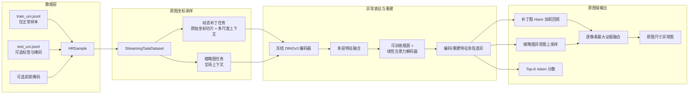

# SurfaceMind

> **High-resolution Industrial Anomaly Detection** - 面向高分辨率工业表面、结构件与装配件的正常样本异常检测框架。

SurfaceMind 将预训练 DINOv3 表征、Dinomaly 特征重建、原图坐标级多尺度切片和正常样本阈值校准组合为一条可训练、可推理、可评估的工程链路。它适合缺陷样本稀少、缺陷形态开放、且需要保留微小缺陷空间证据的场景。

## 核心价值

- **只用 OK 样本训练**：训练集明确限制为无掩码、`label=0` 的正常图像；未知或罕见缺陷可作为偏离正常分布的异常被定位。
- **保留原图坐标**：图像按原始空间坐标切片、推理后回填并融合为原始尺寸异常图，避免先等比例缩小整图导致的细小缺陷信号衰减。
- **局部细节与全局语义并行**：动态补丁分支检测局部纹理，缩略图分支提供全局上下文；多分辨率上下文在特征空间融合。
- **可复现的判定链路**：训练后仅使用正常训练样本生成图像级与像素级阈值，按 `clsname` 保存分类别阈值，并在推理结果中记录分数、阈值、二值掩码和像素数量。
- **面向工程运行**：流式数据集限制全图解码缓存；任务可分配到多张 GPU；配置、任务定义、模型权重和校准结果均随检查点保存。

## 架构总览



训练时，动态补丁任务与可选缩略图任务分别保存权重；训练结束后，框架加载这些任务模型对全部正常训练图做一次推理，生成 `score_calibration.json`。推理时使用相同任务定义恢复模型，将局部和全局结果融合为原图尺寸异常图，并应用校准阈值给出图像级与像素级判定。

## 为什么不是传统两代方案

| 维度 | 第一代：OpenCV 规则视觉 | 第二代：CNN 记忆型方案 | SurfaceMind：预训练表征异常检测 |
| --- | --- | --- | --- |
| 判定依据 | 灰度、边缘、模板差、形态学规则 | CNN 特征与正常记忆库/最近邻距离 | 冻结 DINOv3 多层特征与重建特征的余弦差异 |
| 对未知缺陷 | 规则未覆盖时容易漏检 | 依赖记忆特征的覆盖度与相似样本 | 以正常分布为基准，偏离正常结构或纹理即产生异常证据 |
| 高分辨率细节 | 常需缩放、ROI 和大量阈值调参 | 固定输入尺寸或整图嵌入时，微小缺陷易被稀释 | 动态补丁在原图坐标工作，结果回填到原始尺寸 |
| 上下文能力 | 主要依赖人工构造的局部算子 | 受训练任务与记忆特征限制 | 局部补丁、多分辨率上下文和全图缩略分支共同建模 |
| 适配成本 | 换材质、光照或型号通常需要重写规则 | 需要维护代表性正常记忆，规模与更新策略影响稳定性 | 以冻结通用视觉表征为底座，仅优化轻量重建头，训练数据契约统一 |
| 判定可追溯性 | 阈值分散在多条规则中 | 分数与库版本需要额外治理 | 权重、任务配置、图像/像素阈值、预测 JSONL 和二值掩码均有落盘产物 |

这里的优势是**架构机制**，不是未经验证的性能承诺。实际漏检率、误报率和节拍仍取决于光学成像、正常样本覆盖、缺陷尺度、材质批次与独立验证集。

## 当前程序设计

| 模块 | 责任 | 关键实现 |
| --- | --- | --- |
| `runs/train.py` | 训练入口 | 读取配置与统一训练清单，创建任务，启动训练与后校准 |
| `runs/inference.py` | 推理与评估入口 | 读取测试清单、执行推理、保存预测，并在标签完整时计算指标 |
| `hiad/task/` | 任务契约 | 强制一个 `dynamic_patch` 任务和最多一个 `thumbnail` 任务，任务定义写入 `tasks.json` |
| `hiad/datasets/` | 流式采样 | 原图尺寸建索引；逐样本、逐补丁读取；仅保留一个已解码图像缓存 |
| `hiad/models/dinov3.py` | 表征底座 | 通过 `timm` 加载预训练 DINOv3，固定全部编码器参数并提取中间层特征 |
| `hiad/detectors/hr_dinomaly.py` | 异常检测器 | 训练瓶颈与 8 层线性注意力解码器，以多层编码/解码余弦差异生成异常证据 |
| `hiad/inferencer/` | 多任务推理 | 管理任务检查点、多 GPU 任务分配、补丁回填、全局图融合和阈值判定 |
| `hiad/runtime/score_calibration.py` | 阈值校准 | 从正常训练图分位数计算全局与分类别图像/像素阈值 |
| `hiad/evaluation/` | 指标与图像化 | 按类别计算指标，输出热力图、预测边界和可选 GT 对比图 |

### 关键算法路径

1. **数据约束**：训练样本必须是无缺陷、无像素掩码的正常图，并携带非空 `clsname`。可选 `foreground` 掩码用于在训练阶段抑制背景干扰。
2. **动态多尺度采样**：`DynamicTaskGenerator` 将原图划为边界对齐的主补丁；`--ds-factors` 为每个主补丁提供包含它的更大感受野。`stride` 可设置重叠，以提高边界区域的冗余观测。
3. **特征重建**：冻结的 DINOv3 输出中间层表征；可训练瓶颈和解码器学习复现正常表征。训练仅更新重建部分，降低小规模现场数据直接微调整个视觉骨干的风险。
4. **困难正常样本关注**：余弦蒸馏损失支持从 warmup 逐步提高 hard-mining 比例，并以较低系数保留易样本梯度；同时提供梯度裁剪、AMP 与 TF32 开关。
5. **异常图生成**：各层的编码/重建特征余弦距离先在 token 级取最大，再上采样到补丁尺寸；不同补丁以 Hann 权重回填，减轻拼接边缘不连续。
6. **全局与局部融合**：缩略图分支异常图上采样到原图尺寸后，与补丁融合图逐像素取最大值；图像分数取各任务 Top-K token 分数的最大值，保持对局部强异常的敏感性。
7. **校准与决策**：使用全部正常训练图像的分位数建立图像级与像素级阈值。推理优先选择 `clsname` 对应阈值，缺失时回退到全局阈值；图像级判定为 `score > threshold`。

## 环境要求

- Python `>= 3.10`
- NVIDIA CUDA GPU。当前训练和推理工作进程均以 CUDA 设备运行。
- PyTorch `>= 2.0`，以及与本机 CUDA 匹配的 PyTorch 构建。
- `timm >= 1.0.22`，用于加载预训练 DINOv3；首次运行可能需要获取预训练权重。

```bash
conda create -n surfacemind python=3.10 -y
conda activate surfacemind

# 请先按 CUDA 版本安装匹配的 PyTorch，再安装项目依赖
pip install -U pip
pip install -e .
```

依赖声明位于 [`pyproject.toml`](pyproject.toml)，也可使用 `requirements.txt` 安装。

## 数据协议

传给 `--data-root` 的目录必须在根目录包含统一清单：

```text
dataset-root/
├── train_uni.jsonl
├── test_uni.jsonl
├── part_a/
│   ├── train/OK/...
│   ├── test/...
│   └── ground_truth/...
└── ...
```

训练清单中的每一行都是 JSON。训练只接受正常记录：

```json
{"filename": "part_a/train/OK/000001.png", "clsname": "part_a", "label": 0, "label_name": "good", "foreground": "part_a/foreground/000001.png"}
```

测试记录支持图像级标签和异常区域掩码：

```json
{"filename": "part_a/test/scratch/000101.png", "mask": "part_a/ground_truth/scratch/000101.png", "clsname": "part_a", "label": 1, "label_name": "scratch"}
```

字段约束：

| 字段 | 训练 | 测试 | 说明 |
| --- | --- | --- | --- |
| `filename` | 必填 | 必填 | 相对 `data-root` 的图像路径 |
| `clsname` | 必填 | 必填 | 非空类别名；用于分类别阈值选择与指标聚合 |
| `label` | 必须为 `0` | 推荐 `0` 或 `1` | 图像级指标要求每个类别同时包含正常与异常标签 |
| `mask` | 不允许 | 异常样本推荐提供 | 像素指标和 GT 对比可视化所需的二值掩码 |
| `label_name` | 可选 | 可选 | 人类可读的状态或缺陷名称 |
| `foreground` | 可选 | 当前训练路径使用 | 用于构造去背景训练图，掩码尺寸不匹配时按最近邻对齐 |

仓库内 [`dataSets/README.md`](dataSets/README.md) 提供 MVTec、VisA 与 Real-IAD 数据的准备说明；其中的 RealIAD-2K 清单可作为格式示例。

## 训练

以下命令使用 512 x 512 主补丁、一个二倍上下文尺度与 512 x 512 全局缩略图任务：

```bash
python runs/train.py \
  --data-root /path/to/dataset-root \
  --config configs/dinomaly.yaml \
  --patch-size 512 \
  --stride -1 \
  --ds-factors 0 1 \
  --thumbnail-size 512 \
  --batch-size 16 \
  --gpus 0 \
  --checkpoint-root results/dinomaly_checkpoints \
  --log-root results/dinomaly_logs
```

参数说明：

| 参数 | 含义 |
| --- | --- |
| `--patch-size` | 主补丁边长，必须是 DINOv3 的 16 像素 patch size 的倍数 |
| `--stride` | 主补丁滑动步长；`-1` 表示不重叠的默认步长，设为更小正整数可形成重叠区域 |
| `--ds-factors` | 升序、以 `0` 开始的尺度因子。例如 `0 1` 代表主补丁外再取二倍范围的上下文 |
| `--fusion-weights` | 可选的主补丁与各上下文分支融合权重，数量须与 `--ds-factors` 一致 |
| `--thumbnail-size` | 全局缩略图任务输入边长，必须为 16 的倍数 |
| `--gpus` | 逗号分隔的 CUDA 设备编号。任务以 round-robin 方式分配给设备 |

默认配置在 [`configs/dinomaly.yaml`](configs/dinomaly.yaml)。其中包括训练迭代、困难样本比例、混合精度、每源图像采样补丁数、Top-K 图像评分，以及图像/像素级校准分位数。

### 训练产物

```text
results/dinomaly_checkpoints/
├── dinomaly.yaml                 # 训练时复制的配置
├── args.json                     # 命令行参数快照
├── tasks.json                    # 动态补丁 / 缩略图任务定义
├── dynamic_patch_weight.pkl      # 动态补丁检测器权重
├── thumbnail_weight.pkl          # 缩略图检测器权重（启用时）
└── score_calibration.json        # 正常样本校准的全局与分类别阈值
```

`score_calibration.json` 绑定当前 `score_top_k`。若改变该评分策略、任务定义或模型配置，应重新训练并校准，不应混用旧的校准文件。

## 推理、判定与评估

```bash
python runs/inference.py \
  --data-root /path/to/dataset-root \
  --manifest test_uni.jsonl \
  --config configs/dinomaly.yaml \
  --checkpoint-root results/dinomaly_checkpoints \
  --batch-size 16 \
  --gpus 0 \
  --log-root results/dinomaly_logs \
  --vis-root results/dinomaly_vis \
  --vis-size 1024
```

推理会生成以下可追溯输出：

```text
results/dinomaly_logs/
├── inference.log
├── predictions.jsonl             # 图像分数、阈值、OK/NG 判定、像素统计
└── masks/                        # 每张图的预测二值异常掩码（有像素阈值时）

results/dinomaly_vis/
└── <clsname>_<index>_<image>     # 原图 + 热力图 + 预测边界 + 可选 GT 边界
```

当测试清单满足标注条件时，程序自动按类别执行评估：

| 标注条件 | 输出指标 |
| --- | --- |
| 每个类别都有 `label=0` 与 `label=1` | 图像级 AUROC、AP、F1 |
| 上述条件成立，且所有异常图都有 `mask` | 像素级 AUROC、AP、F1、AUPRO |
| 标签或掩码不完整 | 跳过不满足条件的指标，仍保存预测与可视化 |

评估指标用于对比模型能力；线上 OK/NG 与像素掩码使用的是训练后保存的正常样本校准阈值，而非测试集上的最优阈值。

## 验证与开发

```bash
pytest -q
```

测试覆盖动态任务约束、流式数据集、采样公平性、Dinomaly 评分、阈值校准、预测落盘、评估指标和 CLI 推理路径。修改模型、数据协议或评分逻辑时，应同步运行相关测试并重新生成校准结果。

## 工程边界与落地建议

- SurfaceMind 解决的是视觉表征与异常判定链路，不替代照明、曝光、焦距、相机分辨率、定位与遮挡控制。目标缺陷小于有效像素分辨率时，算法不能补回缺失的光学证据。
- 训练集应覆盖正常件的材质、颜色、工位、批次、姿态和可接受纹理波动；否则这些变化可能被识别为异常。
- 对频繁出现且定义清晰的缺陷，建议在 SurfaceMind 的召回型异常检测之后叠加有监督分类或分割复核；对低置信度样本，在业务系统中设置复检状态比直接判 OK 更符合低漏检要求。
- 线上部署前应按缺陷类型、尺寸、工位/ROI、材质、批次和成像条件报告召回与误报，并使用独立时间段或批次的数据确定最终阈值。

---

**项目元数据**：Python `>=3.10` · PyTorch · DINOv3 (`timm`) · Dinomaly · OpenCV · 原图尺寸异常定位
