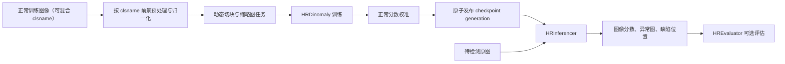

# HiAD

HiAD 是一个面向高分辨率工业图像的异常检测库。当前实现以冻结的 timm DINOv3 为特征提取器，以 Dinomaly 为检测器，通过原图动态切块、缩略图上下文、多风险评分和正常样本校准，在保留源图分辨率的同时输出图像级异常分数、缺陷判定、异常图和缺陷位置。

本文档面向希望调用 HiAD 进行训练、推理和评估的使用者。

## 核心能力

- 保留输入图像的原始宽高，按需生成局部动态窗口。
- 使用 `dynamic_patch` 分支保留局部细节，使用 `thumbnail` 分支补充全局上下文。
- 支持多尺度局部特征融合和重叠窗口聚合。
- 使用冻结的 DINOv3 提取特征；预处理阶段不会训练或更新 DINO 参数。
- 以一个共享 Dinomaly checkpoint 覆盖同一产品族的多个 `clsname` 变体。
- 按 `clsname` 选择各自的前景参考，同时使用一个全局正常分数校准和判定阈值。
- 使用 generation 机制原子发布 checkpoint、预处理产物、任务配置和校准文件。
- 支持多 GPU 训练、推理和离线评估。

## 运行流程



训练阶段会依次完成：前景参考校准、图像预处理、task 训练、checkpoint 证据收集、正常分数校准和 generation 发布。推理阶段只读取已经发布的 generation，并验证配置、模型和校准身份是否一致。

## 安装与环境

HiAD 要求 Python 3.10 或更高版本。训练和当前推理流程需要 CUDA GPU。

建议先根据本机 CUDA 版本安装 PyTorch，再从仓库根目录安装 HiAD：

```bash
python -m pip install -e .
```

主要依赖包括 PyTorch、timm、Transformers、OpenCV、NumPy、scikit-learn 和 scikit-image，完整声明见 [`pyproject.toml`](../pyproject.toml)。DINOv3 和 SAM2 权重首次使用时由 timm/Transformers 解析；离线环境需要提前缓存对应权重。

## 快速开始

### 1. 准备前景参考

每个 `clsname` 需要一张正常参考图和一张同尺寸的完整前景二值 mask。编辑 [`configs/foreground_references.yaml`](../configs/foreground_references.yaml)：

```yaml
categories:
  variant_a:
    image: data/foreground_references/variant_a.png
    mask: data/foreground_references/variant_a_mask.png
```

mask 只能使用 `{0, 1}` 或 `{0, 255}`，必须同时包含前景和背景，并完整覆盖待检测物体。配置中的相对路径从程序启动目录解析，建议从仓库根目录运行。

### 2. 准备数据

数据根目录只需提供统一元数据：

```text
data/<dataset>/
├── train_uni.jsonl  # 仅正常图，用于共享模型训练和全局校准
└── test_uni.jsonl   # 本地测试图，可包含异常标签和 Ground Truth mask
```

正常样本记录示例：

```json
{
  "filename": "train/variant_a/000.png",
  "clsname": "variant_a",
  "label": 0,
  "label_name": "good",
  "mask": null
}
```

`filename` 相对于 `data_root` 解析。`train_uni.jsonl` 必须满足：

- 非空、仅包含正常图像且不携带 mask。
- 每条记录具有非空 `clsname`，并在前景参考 manifest 中有对应项。
- 解析后的图像路径不能重复。

所有训练记录都会参与共享 Dinomaly 的固定迭代训练；训练完成后，同一完整集合再建立唯一的全局正常分数校准。当前不要求也不划分独立验证集，后续独立验证数据不会改变此命令行或模型拓扑。

### 3. 使用命令行训练

```bash
python runs/train.py \
  --data-root data/MVTec-2K \
  --config configs/dinomaly.yaml \
  --gpus 0,1
```

### 4. 使用命令行推理与评估

```bash
python runs/inference.py \
  --data-root data/MVTec-2K \
  --config configs/dinomaly.yaml \
  --gpus 0,1
```

完整参数和数据加载方式见 [`runs/train.py`](../runs/train.py) 与 [`runs/inference.py`](../runs/inference.py)。

## Python API 调用

### 构造运行配置

仓库中的 [`configs/dinomaly.yaml`](../configs/dinomaly.yaml) 使用“检测器公共配置 + `scoring` + `preprocessing`”结构。直接调用 Python API 时，需要将检测器配置复制为 `patch` 和 `thumbnail` 两组：

```python
import copy

import yaml
from easydict import EasyDict


def load_hiad_config(path: str) -> EasyDict:
    with open(path, encoding="utf-8") as stream:
        raw = yaml.safe_load(stream)

    preprocessing = raw.pop("preprocessing")
    scoring = raw.pop("scoring")
    return EasyDict(
        patch=EasyDict(copy.deepcopy(raw)),
        thumbnail=EasyDict(copy.deepcopy(raw)),
        preprocessing=EasyDict(preprocessing),
        scoring=EasyDict(scoring),
    )


config = load_hiad_config("configs/dinomaly.yaml")
```

`patch` 和 `thumbnail` 必须使用与预处理配置一致的 DINOv3 backbone。`use_fp16`、`anomaly_distance` 和多尺度融合权重会参与 checkpoint 与校准身份，训练和推理配置必须一致。

### 创建样本与任务

```python
from hiad.data import HRSample
from hiad.task import DynamicTaskGenerator

train_samples = [
    HRSample("data/example/train/variant_a/000.png", clsname="variant_a", label=0),
    HRSample("data/example/train/variant_b/001.png", clsname="variant_b", label=0),
]

tasks = DynamicTaskGenerator(
    patch_size=512,
    stride=384,
    ds_factors=[0, 1],
).create_tasks(thumbnail_size=512)
```

任务参数约束：

- `patch_size` 和 `thumbnail_size` 必须是 DINO patch size 16 的正整数倍。
- `stride=None` 时等于 `patch_size`；显式设置时必须位于 `[1, patch_size]`。
- `ds_factors` 必须非空、唯一、升序、非负，并从 `0` 开始。
- 当前 `HRTrainer` 和 `HRInferencer` 的多风险流程要求恰好一个 `dynamic_patch` 和一个 `thumbnail` task。

### 训练

```python
from hiad.detectors import HRDinomaly
from hiad.trainer import HRTrainer

trainer = HRTrainer(
    detector_class=HRDinomaly,
    config=config,
    batch_size=2,
    checkpoint_root="results/dinomaly_checkpoints",
    log_root="results/dinomaly_logs",
    tasks=tasks,
    seed=42,
)

generation_root = trainer.train(
    train_samples=train_samples,
    gpu_ids=[0],
)
print(generation_root)
```

`HRTrainer.train()` 返回本次发布的 generation 路径。所有 `train_samples` 都用于模型训练，并在训练结束后用于这次 generation 的全局校准。

### 推理

```python
from hiad.data import HRSample
from hiad.detectors import HRDinomaly
from hiad.inferencer import HRInferencer

test_samples = [
    HRSample("data/example/test/variant_a/000.png", clsname="variant_a"),
    HRSample("data/example/test/variant_b/001.png", clsname="variant_b"),
]

with HRInferencer(
    detector_class=HRDinomaly,
    config=config,
    checkpoint_root="results/dinomaly_checkpoints",
    gpu_ids=[0],
    batch_size=2,
) as inferencer:
    result = inferencer.inference(test_samples)

print(result["image_scores"])
print(result["is_defect"])
```

建议始终使用上下文管理器，确保线程池、预处理模型和 detector 资源得到释放。`HRInferencer` 不接受带 Ground Truth mask 的输入；mask 只属于离线评估流程。

### 推理返回值

`HRInferencer.inference()` 返回字典，顺序与输入样本一致：

| 字段                  | 含义                                       |
| --------------------- | ------------------------------------------ |
| `domain`              | 当前校准域标识                             |
| `image_paths`         | 输入图像路径                               |
| `image_scores`        | 图像联合风险百分位，NumPy `float64` 数组   |
| `anomaly_maps`        | 每张图的源分辨率局部异常图                 |
| `is_defect`           | 是否超过决策百分位                         |
| `decision_percentile` | generation 中冻结的判定百分位              |
| `joint_percentile`    | 每张图的联合风险百分位                     |
| `defect_margin`       | 相对决策阈值的裕量                         |
| `dominant_branch`     | 主导风险分支                               |
| `branch_percentiles`  | 各风险分支的校准百分位                     |
| `raw_branch_scores`   | 各风险分支的原始分数                       |
| `candidate_location`  | 原图坐标系中的候选缺陷位置和 token 证据    |
| `display_images`      | 仅在传入 `display_size` 时返回的可视化图像 |

### 离线评估

推理输入应是不带 mask 的副本；带标签和 mask 的原始测试样本交给 `HREvaluator`：

```python
from hiad.data import HRSample
from hiad.evaluation import HREvaluator
from hiad.evaluation.metrics import compute_pro
from hiad.evaluation.metrics.torch_backend import (
    compute_imagewise_metrics,
    compute_pixelwise_metrics,
)

labeled_test_samples = [
    HRSample(
        "data/example/test/variant_a/good.png",
        label=0,
        label_name="good",
        clsname="variant_a",
    ),
    HRSample(
        "data/example/test/variant_b/defect.png",
        mask="data/example/test/variant_b/defect_mask.png",
        label=1,
        label_name="defect",
        clsname="variant_b",
    )
]
inference_samples = [
    HRSample(sample.image.image_path, clsname=sample.clsname)
    for sample in labeled_test_samples
]

with HRInferencer(
    detector_class=HRDinomaly,
    config=config,
    checkpoint_root="results/dinomaly_checkpoints",
    gpu_ids=[0],
    batch_size=2,
) as inferencer:
    inference_result = inferencer.inference(
        inference_samples,
        display_size=1024,
    )

evaluator = HREvaluator(
    log_root="results/dinomaly_logs",
    vis_root="results/dinomaly_vis",
)
metrics = evaluator.evaluate(
    test_samples=labeled_test_samples,
    inference_result=inference_result,
    gpu_ids=[0],
    evaluators=[
        compute_imagewise_metrics,
        compute_pixelwise_metrics,
        compute_pro,
    ],
)
```

`HREvaluator` 只负责编排评估、汇总日志和可选可视化，不拥有推理模型，也不在内部重新执行推理。

## Checkpoint generation

训练成功后，`checkpoint_root` 的结构如下：

```text
checkpoint_root/
├── current.json
└── generations/
    └── <generation_id>/
        ├── generation_manifest.json
        ├── tasks.json
        ├── dynamic_patch_weight.pt
        ├── thumbnail_weight.pt
        ├── multirisk_calibration.json
        ├── preprocessing_registry.json
        └── preprocessing/
            ├── variant_a/
            │   ├── preprocessing.yaml
            │   ├── preprocessing_manifest.json
            │   ├── foreground_prototypes.pt
            │   ├── reference_feature_template.pt
            │   └── reference_foreground.rle
            └── variant_b/
```

所有必需产物写入并校验完成后，训练器才会更新 `current.json`。推理器通过 `current.json` 定位当前 generation，并校验 manifest、文件哈希、checkpoint schema、预处理身份和评分配置指纹。

## 主要公开 API

| 导入路径                                            | 职责                                                  |
| --------------------------------------------------- | ----------------------------------------------------- |
| `hiad.data.HRSample`                                | 描述图像、mask、标签和类别；训练与推理的基础输入对象  |
| `hiad.task.DynamicTaskGenerator`                    | 创建动态局部窗口和缩略图 task                         |
| `hiad.detectors.HRDinomaly`                         | 当前高分辨率 Dinomaly detector 实现                   |
| `hiad.trainer.HRTrainer`                            | 编排预处理校准、task 训练、评分校准和 generation 发布 |
| `hiad.inferencer.HRInferencer`                      | 加载已发布 generation，执行多 GPU 推理并生成最终结果  |
| `hiad.evaluation.HREvaluator`                       | 编排离线指标计算、报告和可视化                        |
| `hiad.preprocessing.ForegroundPreprocessorRegistry` | 加载 generation 的 `clsname` 前景预处理注册表         |
| `hiad.scoring.MultiRiskConfig`                      | 构造并指纹化多风险评分配置                            |
| `hiad.scoring.MultiRiskScorer`                      | 对局部与上下文 evidence 计算原始风险                  |

根包 `hiad` 不聚合导出业务类，请从上述子包导入。

## 源码结构与职责

```text
hiad/
├── README.md                         # 本文档
├── __init__.py                       # 根包标记，不聚合业务 API
├── constants.py                      # 跨模块稳定协议常量
├── checkpoints.py                    # generation 创建、原子发布、哈希校验与解析
├── checkpoint_schema.py              # detector checkpoint 结构和字段校验
├── foreground.py                     # 候选前景与参考先验覆盖率计算
│
├── data/                             # 图像、样本、几何和任务输入准备
│   ├── __init__.py                   # data 公共导出
│   ├── samples.py                    # HRImage、HRSample、LRPatch 与动态 patch 创建
│   ├── geometry.py                   # 原图窗口、多尺度索引和切块几何
│   ├── metadata.py                   # JSONL 元数据读取
│   └── preparation.py                # 预处理会话、共享内存和 task 输入组装
│
├── datasets/                         # detector 使用的数据集适配
│   ├── __init__.py                   # datasets 包标记
│   └── patch_dataset.py              # LRPatch 到 PyTorch Dataset 的转换
│
├── models/                           # 通用模型封装
│   ├── __init__.py                   # 模型公共导出
│   └── dinov3.py                     # 冻结的 timm DINOv3 特征编码器
│
├── detectors/                        # 异常检测器接口和实现
│   ├── __init__.py                   # BaseDetector、HRDinomaly 导出
│   ├── base.py                       # detector 抽象接口
│   ├── config.py                     # 根据 task 生成 detector 配置
│   ├── hr_dinomaly.py                # HRDinomaly 训练、证据预测和 checkpoint
│   └── dinomaly/                     # Dinomaly 网络基础实现
│       ├── __init__.py               # 子包标记
│       ├── utils.py                  # hard mining loss 与学习率调度器
│       ├── models/
│       │   ├── __init__.py           # 网络模块导出
│       │   ├── uad.py                # ViTill 编码器-瓶颈-解码器组合
│       │   └── vision_transformer.py # Transformer block、attention 与 MLP
│       └── optimizers/
│           ├── __init__.py           # optimizer 导出
│           └── StableAdamW.py        # StableAdamW 实现
│
├── preprocessing/                    # 前景校准和运行时预处理
│   ├── __init__.py                   # 预处理公共 API 与产物名导出
│   ├── constants.py                  # 预处理 schema、配置键和产物文件名
│   ├── config.py                     # 预处理配置规范化与校验
│   ├── artifacts.py                  # 参考资产、RLE、哈希和 bundle 校验/加载
│   ├── calibration.py                # 生成前景原型、模板、参考 mask 和 manifest
│   ├── dino.py                       # 冻结 DINO 编码器创建和特征网格提取
│   ├── sam.py                        # SAM2 加载、批处理和 mask 预测
│   ├── registration.py               # DINO 对应、几何注册和 SAM prompt 生成
│   ├── masks.py                      # 前景 mask 清理、拓扑和质量门控
│   ├── images.py                     # 图像格式校验、归一化和逆归一化
│   ├── registry.py                   # 按 clsname 延迟加载和释放前景预处理器
│   └── runtime.py                    # ForegroundPreprocessor 生命周期和推理入口
│
├── task/                             # 高分辨率 task 协议
│   ├── __init__.py                   # task 公共导出
│   ├── task.py                       # task 生成和 schema 校验
│   ├── io.py                         # tasks.json 保存与加载
│   └── presentation.py               # task 摘要输出
│
├── runtime/                          # 训练和推理共享的执行原语
│   ├── __init__.py                   # runtime 包说明
│   ├── devices.py                    # GPU ID 校验
│   ├── evidence.py                   # detector evidence 收集和按 task 组装
│   ├── partition.py                  # task/数据轮询分组
│   ├── randomness.py                 # Python、NumPy、PyTorch 随机种子
│   └── logging.py                    # 文件与控制台 logger 创建
│
├── scoring/                          # 多风险评分、校准与输出组装
│   ├── __init__.py                   # scoring 公共导出
│   ├── contracts.py                  # evidence、subscore、候选位置等不可变契约
│   ├── config.py                     # MultiRiskConfig 构造、校验和指纹
│   ├── multirisk.py                  # peak、region、line、context 风险计算
│   ├── calibration.py                # 正常 ECDF 校准、加载、保存和风险融合
│   └── pipeline.py                   # evidence 合并、异常图重建和批量输出
│
├── trainer/                          # 训练用例编排
│   ├── __init__.py                   # 延迟导出 HRTrainer
│   ├── trainer.py                    # 训练入口和完整 generation 生命周期
│   ├── worker.py                     # 单 GPU task 训练 worker
│   ├── sources.py                    # 统一训练源验证和 train_uni.jsonl 加载
│   └── checkpoint_evidence.py        # checkpoint 重载和校准 evidence 收集
│
├── inferencer/                       # 生产推理用例编排
│   ├── __init__.py                   # HRInferencer 导出
│   ├── inferencer.py                 # 预处理、并行 evidence、评分和资源生命周期
│   └── modelmanager.py               # detector GPU/CPU 驻留和模型槽管理
│
├── evaluation/                       # 与推理解耦的离线评估
│   ├── __init__.py                   # HREvaluator 导出
│   ├── evaluator.py                  # 评估、日志和可视化编排
│   ├── inputs.py                     # 推理结果与 Ground Truth 对齐
│   ├── execution.py                  # 指标按 GPU 分组执行
│   ├── report.py                     # 类别指标和均值表格报告
│   ├── visualization.py              # 原图、异常图和 mask 可视化保存
│   └── metrics/
│       ├── __init__.py               # compute_pro 导出
│       ├── common.py                 # 指标输入校验和 mask 展平
│       ├── numpy_backend.py          # NumPy/scikit-learn 图像与像素指标
│       ├── torch_backend.py          # GPU 上的图像与像素指标
│       └── pro.py                    # Per-Region Overlap 指标
│
└── syn/                              # 可选异常合成
    ├── __init__.py                   # synthesizer 导出
    └── syn.py                        # BaseAnomalySynthesizer 与随机方块合成器
```

### 包之间的职责边界

- `trainer/` 只负责训练用例，不承担生产推理。
- `inferencer/` 只加载已发布 generation 并执行推理，不更新模型参数。
- `preprocessing/` 负责从原图得到统一的归一化前景输入，DINO 在此仅作为冻结特征提取器。
- `detectors/` 负责模型训练和原始 evidence 预测，不负责整图校准决策。
- `scoring/` 将 detector evidence 转换为可解释的多分支风险、异常图和最终判定。
- `evaluation/` 消费推理结果与 Ground Truth，不持有 detector 或重新执行推理。
- `runtime/` 只放训练与推理共享的无业务编排执行原语。

## 重要运行约束

1. **DINO 始终冻结。** `TimmDinoV3Encoder` 会关闭梯度并保持 eval 模式，预处理与 detector 都只将其作为特征提取器。
2. **统一训练与全局校准。** 所有 `train_uni.jsonl` 正常记录先参与共享权重训练，再共同建立全局校准；`test_uni.jsonl` 只用于本地评估。
3. **推理输入不携带 mask。** Ground Truth mask 只能传给 `HREvaluator`。
4. **配置身份必须一致。** DINO backbone、`use_fp16`、异常距离、融合权重和评分配置均会参与产物验证或校准指纹。
5. **不要绕过 generation。** `HRInferencer` 应接收包含 `current.json` 的共享 checkpoint 根目录，而不是直接指向某个权重文件。
6. **显存按阶段管理。** 预处理模型和 detector 会顺序使用 GPU；训练 worker 在 task 间释放 detector，推理器通过 `ModelManager` 管理驻留模型数量。
7. **源图坐标保持一致。** 局部窗口可填充或缩放到模型尺寸，但最终异常图和候选位置会映射回原图坐标系。

## 进一步阅读

- [`tutorial/advanced_zh.md`](../tutorial/advanced_zh.md)：动态切块、多尺度融合和高分辨率设置。
- [`configs/dinomaly.yaml`](../configs/dinomaly.yaml)：当前 detector、scoring 和 preprocessing 配置。
- [`runs/train.py`](../runs/train.py)：标准命令行训练入口。
- [`runs/inference.py`](../runs/inference.py)：标准命令行推理与评估入口。
- [`data/README.md`](../data/README.md)：数据集下载与目录组织。
